# 🧭 World over Words — The Paper Canon of Saining Xie

> *"Training world models over word models."* — Saining Xie (谢赛宁), founding manifesto of AMI Labs

A curated, **timestamped** map of every research paper, model, and system mentioned by **Saining Xie (谢赛宁)** — co-founder & Chief Scientist of **AMI Labs** (with Yann LeCun) — during his **first-ever interview**: a 6-hour-45-minute marathon with podcaster **Zhang Xiaojun (张小珺)**, recorded in Brooklyn after the 2026 Spring Festival.

Its centerpiece is a moment around **2:21:40** where Saining tries to name the *"~20–25 papers that deeply shaped deep learning and AI"* — the works Saining considers genuine 代表作 (masterpieces) — while insisting *"那我一篇都没有"* ("I don't have a single one of those"). This repo reconstructs that canon, separates it from his own work, and **decodes the names the auto-transcription garbled**.

> 🌐 **Website:** https://chaoyue0307.github.io/world-over-words/

---

## 🎬 Watch / Listen

| Format | Link |
|---|---|
| 📺 Video (Bilibili) | https://www.bilibili.com/video/BV1tew5zVEDf/ |
| 🎧 Audio (小宇宙 / Xiaoyuzhou) | https://www.xiaoyuzhoufm.com/episode/69b77577f8b8079bfa8eb837 |
| 🎧 Apple Podcasts (ep. 133) | https://podcasts.apple.com/cn/podcast/id1634356920?i=1000755501308 |
| 📝 Text version (official) | 《对话谢赛宁：逃出硅谷！》 — WeChat 公众号 "语言即世界 language is world" |

Every **▶ timestamp** below deep-links into the video at that exact second.

---

## 👥 The people

- **Saining Xie (谢赛宁)** — co-founder & Chief Scientist, AMI Labs; faculty at NYU.
  [🌐 sainingxie.com](https://www.sainingxie.com/) · [𝕏 @sainingxie](https://x.com/sainingxie) · [GitHub @s9xie](https://github.com/s9xie)
- **Zhang Xiaojun (张小珺)** — award-winning tech journalist; host of 《商业访谈录》, founder of "语言即世界" studio.
  [𝕏 @zhang_benita](https://x.com/zhang_benita) · [▶ YouTube @benitazxj](https://www.youtube.com/@benitazxj)

---

## ⭐ Tier 1 — Papers Saining calls GREAT (代表作)

Saining's own spontaneous enumeration of the deep-learning canon (*"我可能数不全"* — "I can't list them all"). Saining keeps his own work out of this tier: asked *"DiT 不算吗?"* he answers *"算 0.25"* — only a quarter.

### 1. LeNet · *LeCun et al., 1998*

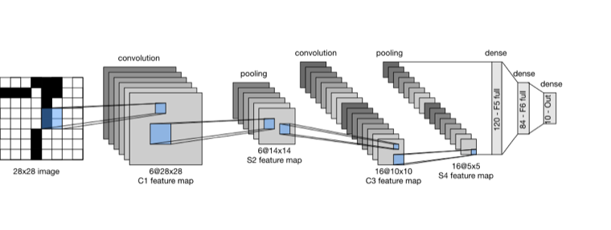

The first convolutional neural network trained end-to-end with backpropagation, built to read handwritten digits (famously deployed on bank checks). It introduced the conv → pool → conv stack that every modern vision model still echoes — arriving a decade before the data and GPUs that would finally make it shine.

📄 [paper](http://yann.lecun.com/exdb/publis/pdf/lecun-98.pdf) · ▶ [2:21:40](https://www.bilibili.com/video/BV1tew5zVEDf/?t=8500)

### 2. AlexNet · *Krizhevsky, Sutskever, Hinton, 2012*

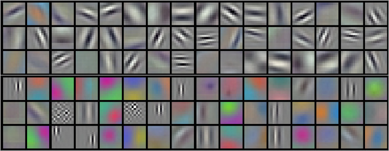

Widely credited with sparking the modern deep-learning boom. Winning ImageNet 2012 by a wide margin — using GPUs, ReLUs and dropout — it convinced the field that learned deep features, not hand-crafted ones, were the future.

📄 [paper](https://proceedings.neurips.cc/paper/2012/hash/c399862d3b9d6b76c8436e924a68c45b-Abstract.html) · ▶ [2:21:40](https://www.bilibili.com/video/BV1tew5zVEDf/?t=8500)

### 3. ImageNet · *Deng … Fei-Fei, 2009*

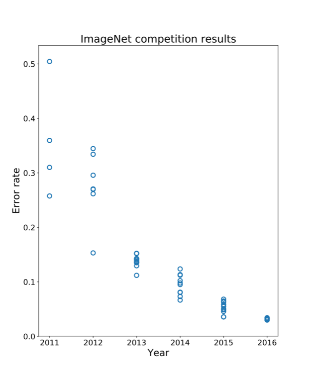

Not a model but the dataset that made everything else possible: ~14M human-labeled images across 1000+ categories. Fei-Fei Li's bet that **data**, not just algorithms, was the real bottleneck — and the benchmark that drove a decade of progress.

📄 [paper](https://ieeexplore.ieee.org/document/5206848) · ▶ [2:21:40](https://www.bilibili.com/video/BV1tew5zVEDf/?t=8500)

### 4. ResNet · *He et al., 2016*

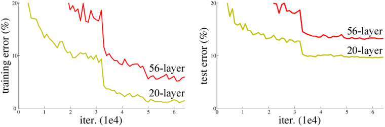

Residual ("skip") connections fixed the vanishing-gradient problem and let networks scale to 100–1000+ layers. One of the most-cited papers in all of science, the default vision backbone for years, and the conceptual ancestor of the residual stream inside Transformers.

📄 [paper](https://arxiv.org/abs/1512.03385) · ▶ [2:21:40](https://www.bilibili.com/video/BV1tew5zVEDf/?t=8500)

### 5. R-CNN · *Girshick et al., 2014*

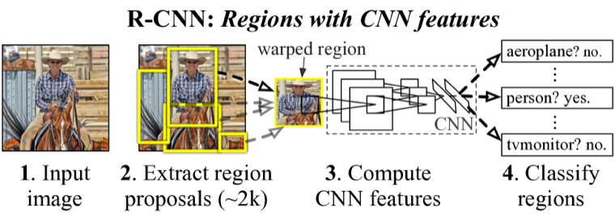

Brought CNN features to object detection — region proposals scored by a CNN. The recipe that launched the modern detection pipeline behind self-driving and medical imaging.

📄 [paper](https://arxiv.org/abs/1311.2524) · ▶ [2:21:40](https://www.bilibili.com/video/BV1tew5zVEDf/?t=8500)

### 6. Fast R-CNN · *Girshick, 2015*

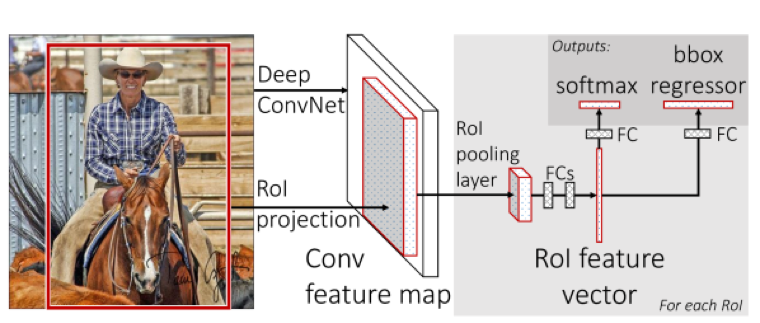

Made R-CNN end-to-end and far faster — a single pass over the image with RoI pooling, jointly predicting class and box. The basis for Faster R-CNN and Mask R-CNN.

📄 [paper](https://arxiv.org/abs/1504.08083) · ▶ [2:21:40](https://www.bilibili.com/video/BV1tew5zVEDf/?t=8500)

### 7. Transformer — *Attention Is All You Need* · *Vaswani et al., 2017*

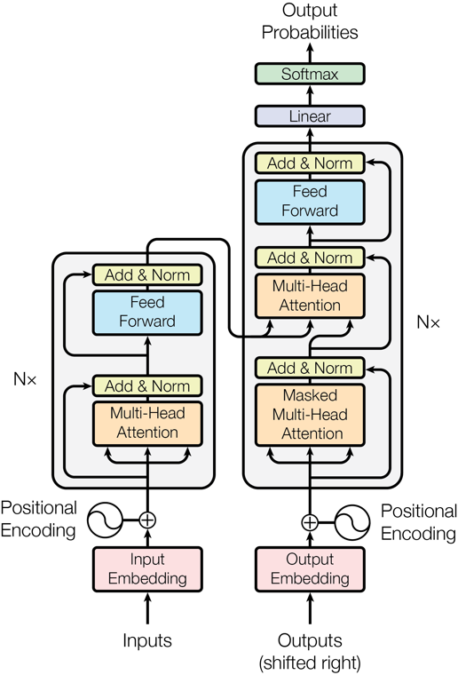

Threw out recurrence and convolution, keeping only attention. It made training massively parallel and is the single architecture beneath GPT, BERT, CLIP, ViT and diffusion models — most of today's frontier AI.

📄 [paper](https://arxiv.org/abs/1706.03762) · ▶ [2:22:02](https://www.bilibili.com/video/BV1tew5zVEDf/?t=8522)

### 8. Attention · *Bahdanau, Cho & Bengio, 2014* ⚠️ *garbled in transcript — see [decoding](#-decoding-the-garbled-names)*

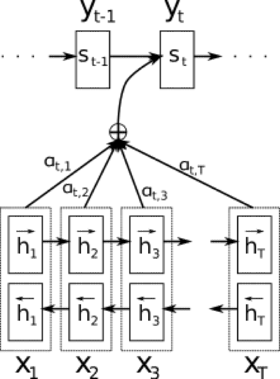

Introduced the attention mechanism for neural machine translation: instead of cramming a sentence into one vector, let the model "look back" at the relevant words. The seed idea that Transformers later scaled into everything.

📄 [paper](https://arxiv.org/abs/1409.0473) · ▶ [~2:22:04](https://www.bilibili.com/video/BV1tew5zVEDf/?t=8524)

### 9. GPT-3 · *Brown et al., 2020*

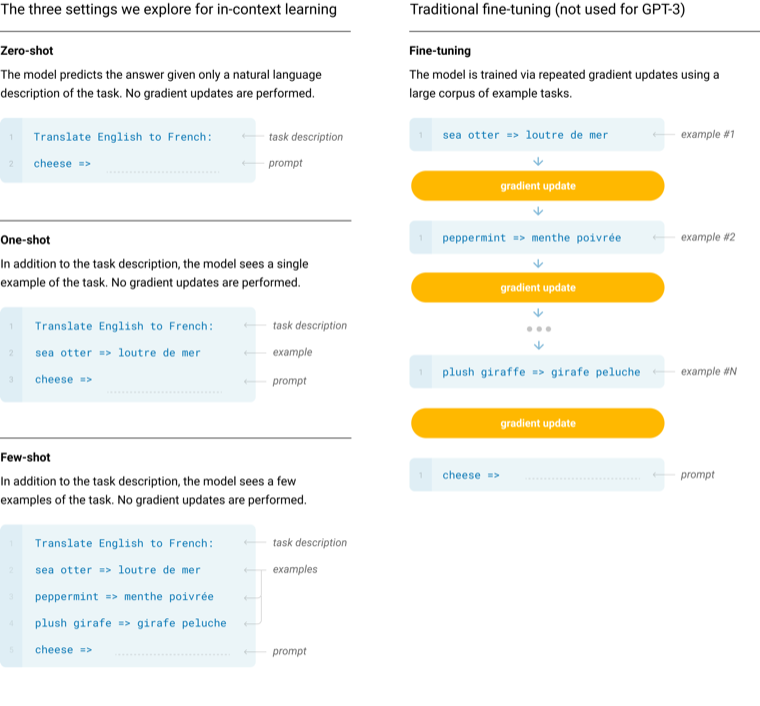

At 175B parameters, it showed that scale alone unlocks emergent few-shot ability: describe a task in the prompt and the model just does it. The empirical proof of the scaling-law thesis and the direct ancestor of ChatGPT.

📄 [paper](https://arxiv.org/abs/2005.14165) · ▶ [2:22:02](https://www.bilibili.com/video/BV1tew5zVEDf/?t=8522)

### 10. BERT · *Devlin et al., 2018*

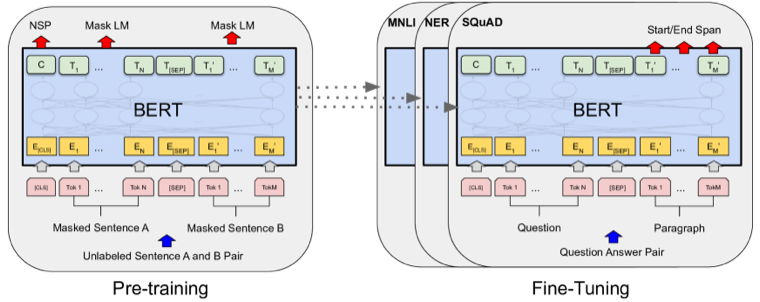

Bidirectional masked-language pretraining — hide words, predict them from both sides. It advanced the state of the art across NLP, made "pretrain then fine-tune" standard, and directly inspired Saining's own MAE for images.

📄 [paper](https://arxiv.org/abs/1810.04805) · ▶ [2:22:02](https://www.bilibili.com/video/BV1tew5zVEDf/?t=8522)

### 11. CLIP · *Radford et al., 2021*

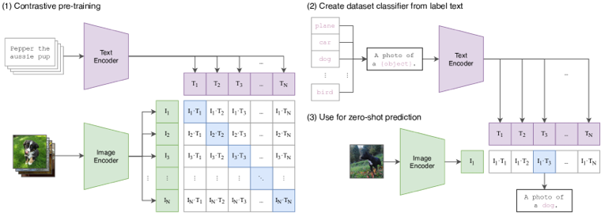

Trained on 400M image–text pairs to align pictures and language in one space, enabling zero-shot classification and becoming the visual backbone of the text-to-image era. (Saining also notes its blind spots at 3:18.)

📄 [paper](https://arxiv.org/abs/2103.00020) · ▶ [2:22:02](https://www.bilibili.com/video/BV1tew5zVEDf/?t=8522)

### 12. ViT — Vision Transformer · *Dosovitskiy et al., 2020*

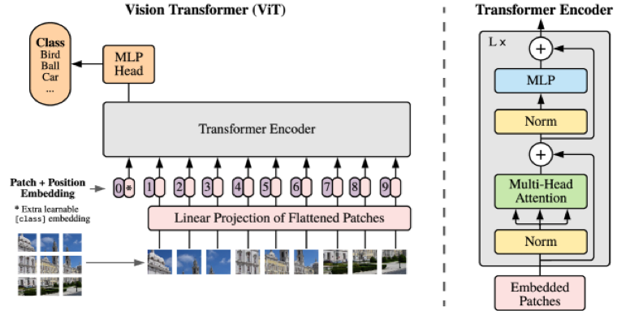

Showed that a plain Transformer, fed image patches as tokens, beats CNNs once data and compute are large enough — unifying vision and language under one architecture.

📄 [paper](https://arxiv.org/abs/2010.11929) · ▶ [2:22:14](https://www.bilibili.com/video/BV1tew5zVEDf/?t=8534)

### 13. GAN · *Goodfellow et al., 2014*

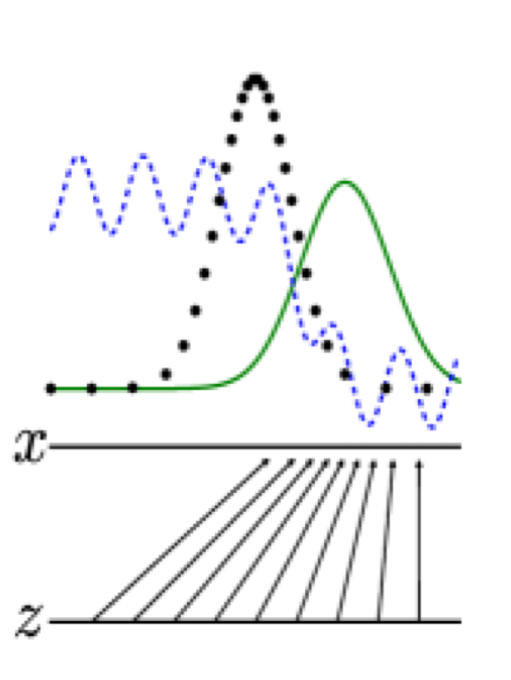

A generator and a discriminator locked in a minimax game. The framework that first made photorealistic synthesis possible and dominated generative modeling before diffusion.

📄 [paper](https://arxiv.org/abs/1406.2661) · ▶ [2:22:14](https://www.bilibili.com/video/BV1tew5zVEDf/?t=8534)

### 14. NeRF · *Mildenhall et al., 2020*

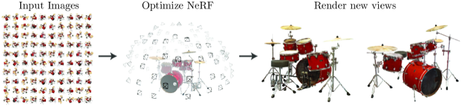

Represents a 3D scene as a tiny neural network of color and density, rendering photorealistic novel viewpoints from a handful of photos. Reignited neural 3D and inverse graphics.

📄 [paper](https://arxiv.org/abs/2003.08934) · ▶ [2:22:25](https://www.bilibili.com/video/BV1tew5zVEDf/?t=8545)

### 15. 3D Gaussian Splatting · *Kerbl et al., 2023*

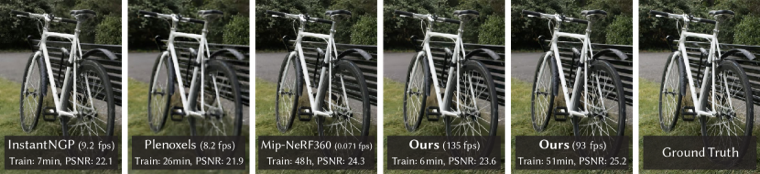

Replaces NeRF's slow volumetric sampling with millions of optimized 3D Gaussians, hitting real-time, high-fidelity rendering — quickly the new default for neural 3D.

📄 [paper](https://arxiv.org/abs/2308.04079) · ▶ [2:22:25](https://www.bilibili.com/video/BV1tew5zVEDf/?t=8545)

### 16. Diffusion / DDPM · *Ho, Jain, Abbeel, 2020*

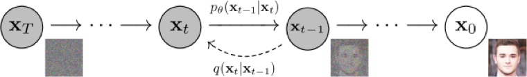

Generate by learning to **reverse** a gradual noising process. DDPM made diffusion practical and surpassed GANs in quality and stability — the engine behind today's image and video generators.

📄 [paper](https://arxiv.org/abs/2006.11239) · ▶ [2:21:09](https://www.bilibili.com/video/BV1tew5zVEDf/?t=8469)

### 17. Stable Diffusion / LDM · *Rombach et al., 2022*

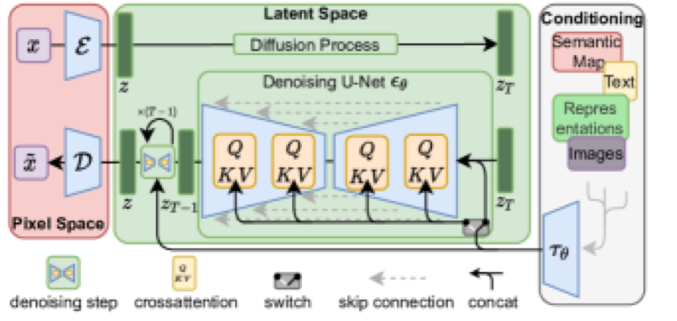

Ran diffusion in a compressed **latent** space, cutting cost enough to make high-resolution generation fast — and, by open-sourcing it, kicked off the consumer generative-AI wave.

📄 [paper](https://arxiv.org/abs/2112.10752) · ▶ [3:07:38](https://www.bilibili.com/video/BV1tew5zVEDf/?t=11258)

---

## 🔍 Decoding the garbled names

The interview is Chinese with English terms mixed in, and the auto-transcription mangled two paper names. Both are decoded here with evidence:

- **"Tension Solution Unit" (~2:22:04) → an attention paper.** *High confidence on "attention," medium on the exact paper.* This transcript reliably renders **self-attention as "software attention" / "Software Tension"** (2:58:30, 2:58:45) — so **"Tension" = attention**. Since Saining lists *Transformer* separately at #6, the best fit is the original attention paper, **Bahdanau et al. 2014**. ⚠️ Confirm by ear at **~2:22:04–2:22:06** — issues/PRs welcome.

---

## 🧪 Tier 2 — Saining's own / co-authored work

Discussed in depth, but **Saining keeps these out of the "great" tier** (he rates DiT "0.25").

### Deeply-Supervised Nets (DSN) · *2015*

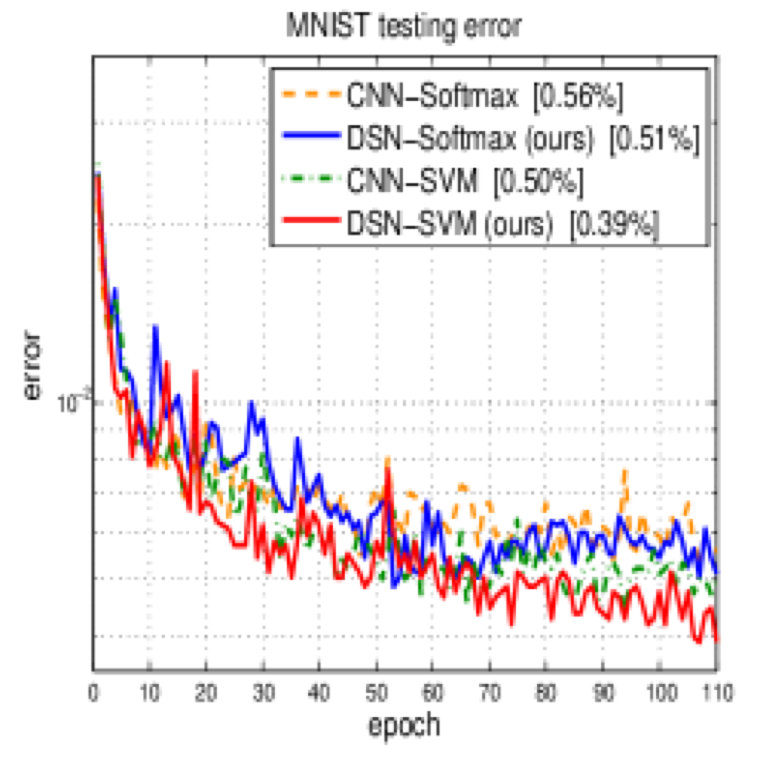

"Deep supervision" — attach classifiers/losses to intermediate layers so gradients reach early ones directly. A recurring motif in his work; he notes REPA is structurally a deeply-supervised net.

📄 [arXiv](https://arxiv.org/abs/1409.5185) · ▶ [0:48:53](https://www.bilibili.com/video/BV1tew5zVEDf/?t=2933)

### HED — Holistically-Nested Edge Detection · *2015*

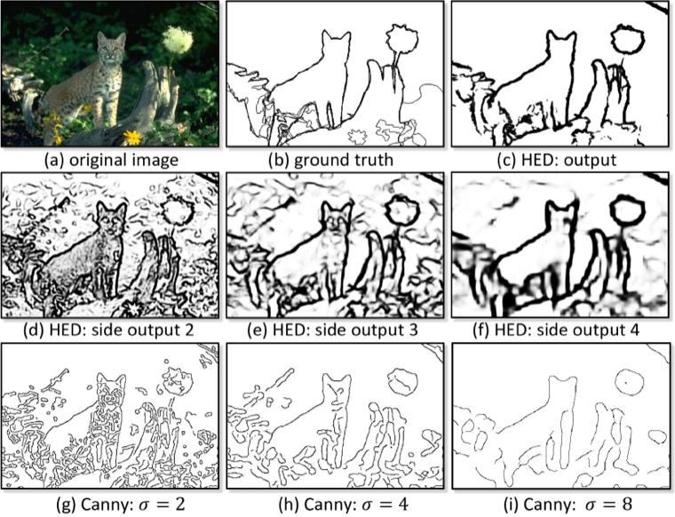

Reframed edge detection as image-to-image prediction with multi-scale deep supervision, setting a new bar. The PhD work he says he's "proud of."

📄 [arXiv](https://arxiv.org/abs/1504.06375) · ▶ [0:48:28](https://www.bilibili.com/video/BV1tew5zVEDf/?t=2908)

### ResNeXt · *2017*

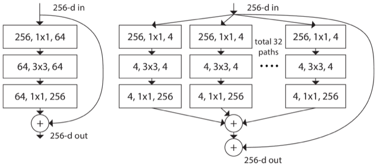

Added "cardinality" — parallel grouped transformations — as a new scaling axis beyond depth and width. Kaiming He named it ("X = next, the next-gen ResNet"); it placed 2nd in the ImageNet challenge.

📄 [arXiv](https://arxiv.org/abs/1611.05431) · ▶ [1:00:39](https://www.bilibili.com/video/BV1tew5zVEDf/?t=3639)

### DiT — Diffusion Transformers · *2023* · *self-rated "0.25"*

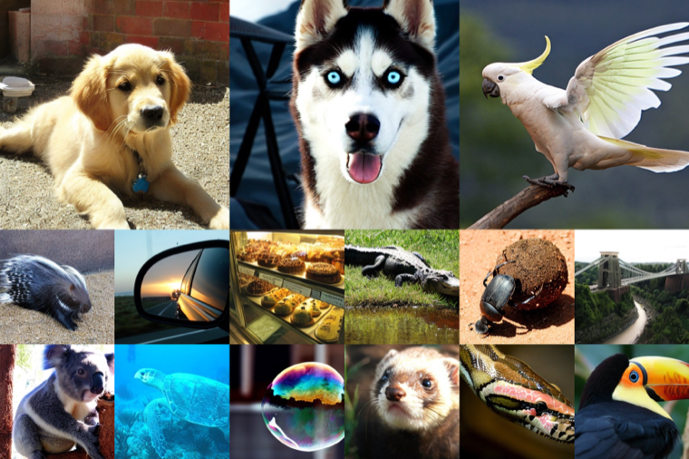

Replaced the U-Net in diffusion with a Transformer, so image generators inherit the clean scaling behavior of LLMs. The backbone behind Sora and modern video models.

📄 [arXiv](https://arxiv.org/abs/2212.09748) · ▶ [2:20:41](https://www.bilibili.com/video/BV1tew5zVEDf/?t=8441)

### SiT — Scalable Interpolant Transformers · *2024*

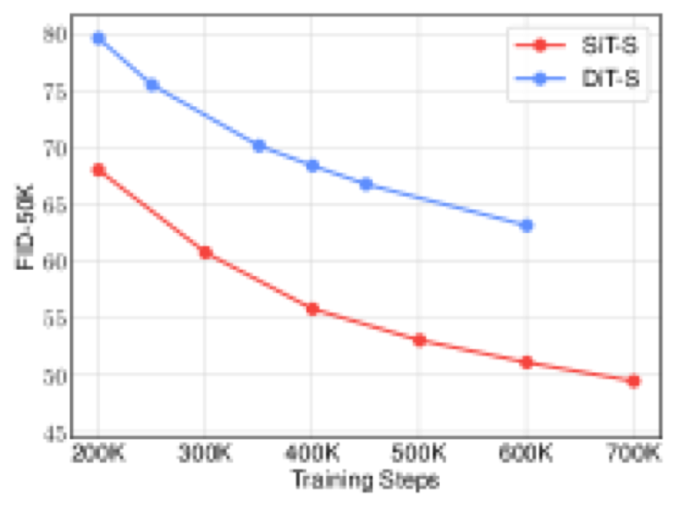

Recasts DiT through stochastic interpolants / flow matching — a more flexible, often better-performing training formulation, now a common academic baseline alongside DiT.

📄 [arXiv](https://arxiv.org/abs/2401.08740) · ▶ [3:15:25](https://www.bilibili.com/video/BV1tew5zVEDf/?t=11725)

### MoCo — Momentum Contrast · *2020*

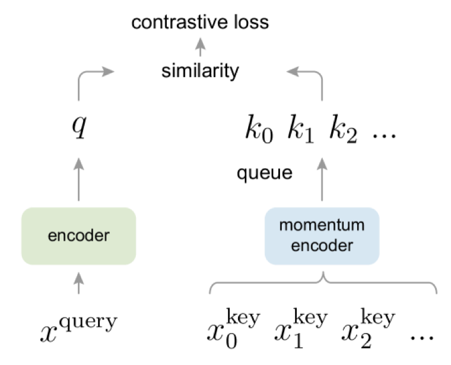

Built a large, consistent dictionary for contrastive self-supervised learning — the first time self-supervised features rivaled supervised ImageNet pretraining on vision tasks. (Kaiming He–led; Saining is a co-author.)

📄 [arXiv](https://arxiv.org/abs/1911.05722) · ▶ [2:25:59](https://www.bilibili.com/video/BV1tew5zVEDf/?t=8759)

### MAE — Masked Autoencoders · *2022*

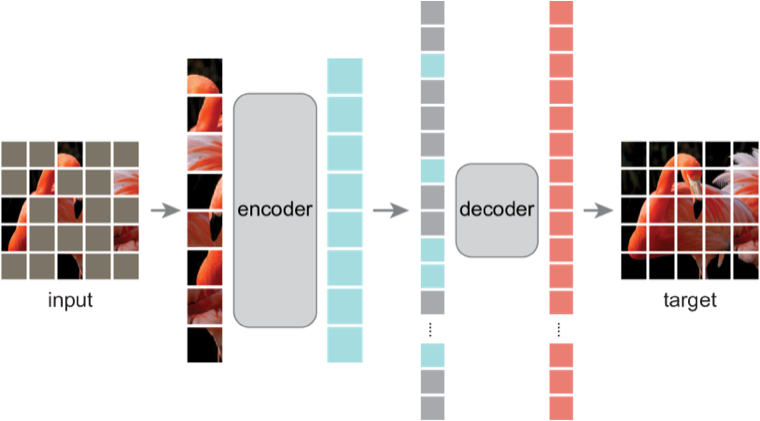

Mask 75% of an image and reconstruct it — a simple, scalable self-supervised recipe that brought BERT's idea to vision. (Kaiming He–led; Saining is a co-author.)

📄 [arXiv](https://arxiv.org/abs/2111.06377) · ▶ [2:26:45](https://www.bilibili.com/video/BV1tew5zVEDf/?t=8805)

### Cambrian-1 · *2024*

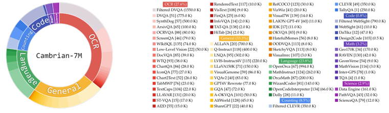

A vision-centric multimodal LLM and a study of how visual representations should connect to language models — Saining's argument that vision deserves first-class treatment, not a bolt-on.

📄 [arXiv](https://arxiv.org/abs/2406.16860) · ▶ [3:15:51](https://www.bilibili.com/video/BV1tew5zVEDf/?t=11751)

### REPA — Representation Alignment · *2025*

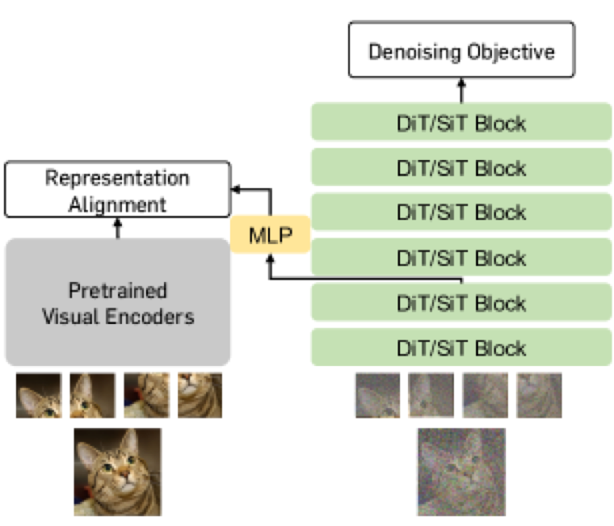

Align a diffusion Transformer's internal features to a strong self-supervised encoder, dramatically speeding up training. "Another keyword: representation," as Saining puts it.

📄 [arXiv](https://arxiv.org/abs/2410.06940) · ▶ [4:01:06](https://www.bilibili.com/video/BV1tew5zVEDf/?t=14466)

### RAE — Representation Autoencoder · *2025*

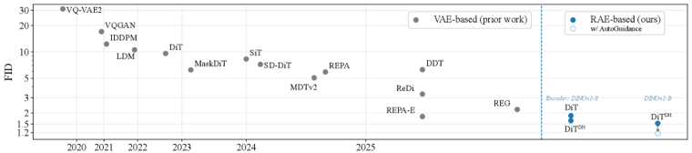

Use a powerful pretrained representation as the generative model's encoder/foundation — pushing the "representation-first" thesis one step further.

📄 [arXiv](https://arxiv.org/abs/2510.11690) · ▶ [4:02:48](https://www.bilibili.com/video/BV1tew5zVEDf/?t=14568)

---

## 🌍 Tier 3 — Other works & systems referenced

Mentioned in passing or as influences — the RL & world-model lineage, plus the systems and concepts Saining name-drops.

### Dyna · *Sutton, 1991*

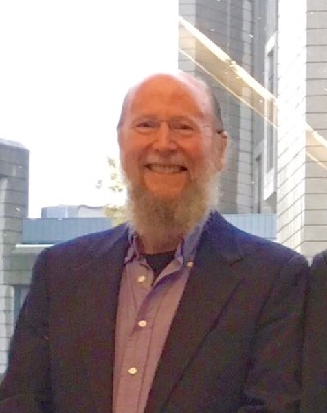

Sutton's model-based RL — learn a world model and plan with it; the reactive vs. model-based "System 1 / System 2" framing Saining invokes. *(Shown: Richard Sutton — Dyna's 1991 diagram has no clean digital figure.)*

📄 [ACM](https://dl.acm.org/doi/10.1145/122344.122377) · ▶ [4:15:20](https://www.bilibili.com/video/BV1tew5zVEDf/?t=15320)

### The Bitter Lesson · *Sutton, 2019 (essay)*

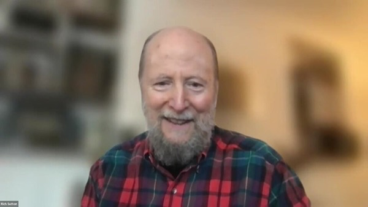

General methods that scale with compute beat hand-crafted knowledge — Saining's foil, who argues LLMs are "anti–Bitter Lesson." *(Shown: Richard Sutton — the essay has no figure.)*

📄 [essay](http://www.incompleteideas.net/IncIdeas/BitterLesson.html) · ▶ [4:10:33](https://www.bilibili.com/video/BV1tew5zVEDf/?t=15033)

### JEPA · *LeCun, 2022*

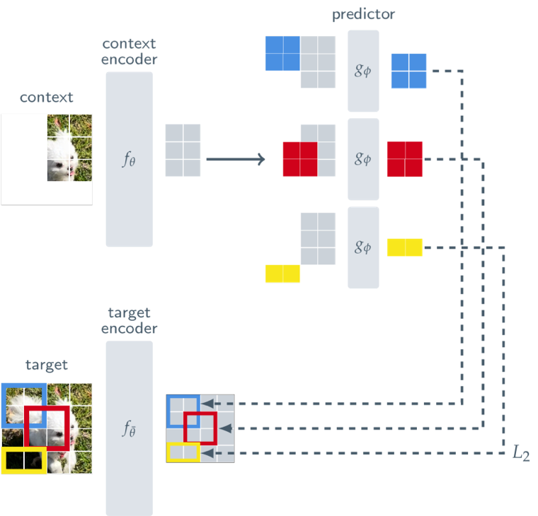

LeCun's blueprint for autonomous machine intelligence — predict in abstract representation space, not pixels or tokens. AMI Labs' north star. *(Figure: the I-JEPA instantiation.)*

📄 [paper](https://openreview.net/forum?id=BZ5a1r-kVsf) · ▶ [6:03:10](https://www.bilibili.com/video/BV1tew5zVEDf/?t=21790)

### Genie · *DeepMind, 2024*

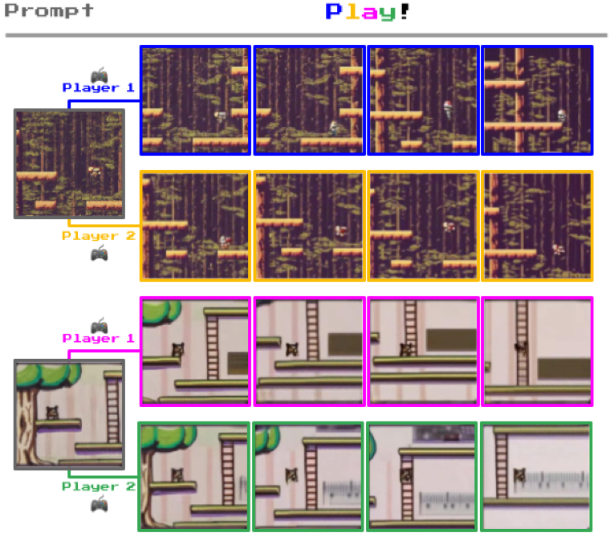

A foundation world model trained from unlabeled internet videos that generates playable, interactive environments.

📄 [arXiv](https://arxiv.org/abs/2402.15391) · ▶ [4:26:52](https://www.bilibili.com/video/BV1tew5zVEDf/?t=16012)

### U-Net · *Ronneberger et al., 2015*

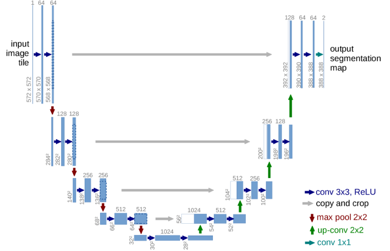

Encoder–decoder with skip connections for image-to-image tasks — the diffusion backbone DiT replaced.

📄 [arXiv](https://arxiv.org/abs/1505.04597) · ▶ [3:04:00](https://www.bilibili.com/video/BV1tew5zVEDf/?t=11040)

### CPC · *van den Oord et al., 2018*

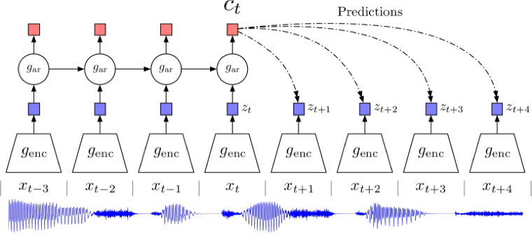

Contrastive Predictive Coding — learn representations by predicting the future in a latent space; an early self-supervised milestone.

📄 [arXiv](https://arxiv.org/abs/1807.03748) · ▶ [2:00:27](https://www.bilibili.com/video/BV1tew5zVEDf/?t=7227)

### Mask R-CNN · *He et al., 2017*

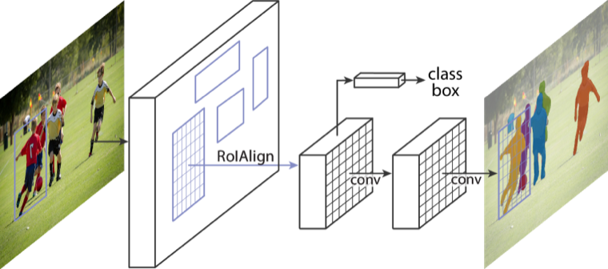

Adds a mask branch to Faster R-CNN for pixel-level instance segmentation. *(Part of the detection line; mentioned, not in Tier 1.)*

📄 [arXiv](https://arxiv.org/abs/1703.06870) · ▶ [2:34:49](https://www.bilibili.com/video/BV1tew5zVEDf/?t=9289)

### Focal Loss · *Lin et al., 2017*

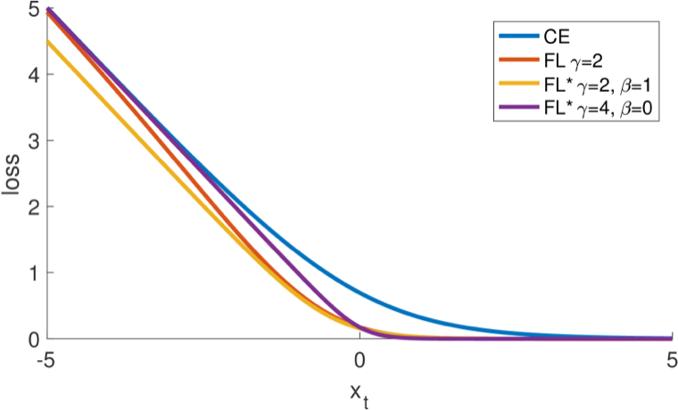

Down-weights easy examples so dense one-stage detectors aren't swamped by background — powering RetinaNet.

📄 [arXiv](https://arxiv.org/abs/1708.02002) · ▶ [2:34:56](https://www.bilibili.com/video/BV1tew5zVEDf/?t=9296)

---

**Contemporary systems / tools name-dropped**
Sora ([openai.com/sora](https://openai.com/sora), cites his DiT) · SeeDance · Nano Banana · Gemini / ChatGPT · a video model likely **Veo** · **PyTorch** ([pytorch.org](https://pytorch.org))

**Concepts / awards (not papers)**
Neural Architecture Search (NAS, reflected on critically, 1:13:52) · Scaling Law (4:10:33) · Marr Prize nomination for his PhD paper (0:50:29)

*Cultural references: 《金刚经》 Diamond Sutra (on research taste); 《万神殿》 Pantheon, TV series by Ken Liu 刘宇坤.*

## 🛠 How this list was built

1. Pulled the **full verbatim transcript** — **4,926 timestamped segments** — of the episode.
2. Scanned every segment for model / paper / architecture names, then read each hit in context.
3. Profiled the transcription's failure modes (e.g. *self-attention → "software attention"*, *inductive bias → "index bias"*) to **decode garbled names**.
4. Separated three tiers: **(1)** papers Saining himself calls great, **(2)** his own work, **(3)** everything else referenced.

This matters because online recaps were wrong: they listed **ConvNeXt** and **V-JEPA** as mentioned, but those names **never appear** in the actual audio (0 hits) — they were imported from Saining's CV. The verbatim transcript fixes that.

## ✨ Features

- ✅ **Every paper** with an official / arXiv link and a **▶ timestamp that deep-links into the video** at that second.
- ✅ **Three tiers** — separates "papers Saining calls *great*" from "Saining's own work" from "merely referenced."
- ✅ **Garbled-name forensics** — decoded with evidence and the exact second to verify by ear.
- ✅ Built from the **complete transcript**, not secondhand summaries.

---

## License

Content licensed **CC BY 4.0**. Paper figures are © their respective authors, shown for educational reference; **LeNet**, **ImageNet**, and the **Richard Sutton** portraits (Dyna, Bitter Lesson) are from Wikimedia Commons. Interview by **Zhang Xiaojun (张小珺)** with **Saining Xie (谢赛宁)**.
Unofficial, fan-made study aid; all rights to the interview belong to its creators.

> Spotted a paper that's missing, or can confirm the garbled name at ~2:22:04? **Open an issue or PR.**
